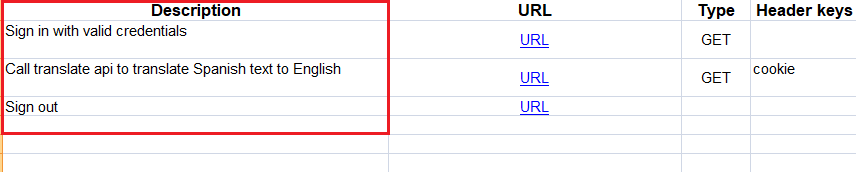
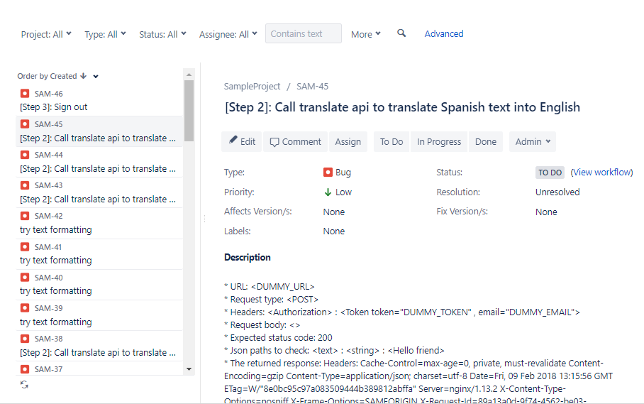

# WebservicesTestZona

Used tools and frameworks
---------------------------------------
1. Rest-Assured
2. Maven repository 
3. TestNG
4. Jxl to extract test data from Excel files


Main features
----------------------------
1. Hybrid framework to test automation Webservices. It is keyword-driven and data-driven framework. So, you can separate testing data in Excel sheet with predefined schema and using some keywords inside Excel sheet you can validate the returned response body, headers and cookies.
2. Supports both REST and SOAP webservices testing. 
3. All classes and methods are implemented in Java with Maven repository to include all dependencies needed. REST-Assured is used to offer a friendly DSL (Domain specific Languages) that describes a connection to an HTTP endpoint and expected results.
4. Utilizes the capabilities of TestNG such as Data provider annotation to separate test data in external file and flexible test suites configuration and management. Also, TestNG generates 2 types of reports, HTML and XML reports. The HTML reports are very descriptive with good statistics and the JUnit XML reports that can be integrated with Jenkins after test execution to have summary status of each deployment.
5. To use the framework, NO need to have any coding skills. ZERO line of code needed. Each test cases can be represented as a row or some rows (if the test case consists of some correlated steps) in the relevant Excel sheet. All you need is to know what is your scope in testing and just add the test data in the Excel sheet with the predefined schema then create the TestNG runner xml file that points to test data. For example:
The predefined schema in that format:
[Description], [URL], [Request method: GET, POST, ...], [Headers keys], [Headers values], [Body(if needed)], [Expected status code], [Assertions]
6. REST-Assured Java API is to test REST webservices and has no direct support for SOAP webservices. However, REST-Assured can test SOAP webservices by adding xml request in the body and execute POST HTTP request.
7. The framework validates the returned status code, response body, headers and cookies. It can validate each field data type and value. If the returned response includes object of arraylist, the framework can validate its size using the keyword ".size()"
8. Can be integrated into DevOps environment to accelerate the delivery process. After each Jenkins deployment, test cases can be executed automatically and the generated XML reports can be passed to Jira to log Defects/Tests automatically. Some configurations needed in Jenkins side.
9. Solves the complexity of testing correlated APIs as any test step can use data (body value, header or cookie) received in the previous steps. For example and more details you can check Sample_2 sheet in Excel test data. For more details about Keywords used and test data schema, you can have a look at the test data samples.
10. Source code is available here: https://github.com/ymhmd/API-Testing-Automation-Framework-SourceCode


New Features in version 2.0
-----------------------------
1. The returned cookies can be validated using keyword `cookie:` 
2. The returned cookies can be reused in the next steps using keyword `#prev_cookies_res[STEP]:PREV_COOKIE_KEY`
* NB: For more details how to use cookie keywords, Please refer to TestDataSample.xls > sample_04


New Features in version 3.0
-----------------------------
1. Version 3.0 supports BDD test cases: The first column called "Description" should have simple plain text illustrating what each step does.



2. Version 3.0 can integrate with Jira to log bugs automatically. The following Jira configuration json file should be passed to the framework to determine required variables such as your Jira domain, email/password of the reporter, in which project the bug is reported and bug priority. Integration with Jira can be disabled by set `false` to key `enable` in Jira json configuration file.
```
{
	"enbale" : true, 
	"domain" : "your_jira_domain",
	"email" : "your_email",
	"password" : "your_password",
	"projectKey" : "your_project_key",
	"issueType" : "Bug/Task/Subtask ....",
	"priority" : "Low/High ...."
}
```
3. The summary of the reported bug in Jira refers to "step number" and the "step description" in the first column in the Excel file.


# Demo

For Version 2.0
----------
1. In the command line execute : `java -jar buenoAPI.jar Runners\Sample2_Runner.xml`.
2. It generates test-output directory which contains the TestNG HTML and XML reports.


For Version 3.0
----------
1. Go to directory Configs > update `jira.json` file with the required values.
2. In the command line execute : `java -jar buenoAPI.jar Runners\Sample.xml Configs\jira.json`.
3. It generates test-output directory which contains the TestNG HTML and XML reports.
4. In case Integration with Jira is disabled, No Bugs are reported to Jira. On the other hand, failed test cases are reported in Jira as Bugs in case Integration with Jira is enabled.
5. In case Integration with Jira is enabled and there are no test cases are failed, No Bugs are reported to Jira.
6. In cases Integration with Jira is enabled and there are some test cases failed, these test are reported into Jira as Bugs.




Future Work
------------
1. To integrate with Jira to log bugs automatically as soon as having bugs > Done in Version 3.0
2. To support Business Driven Development (BDD) test cases > Done in Version 3.0
3. To support SOAP APIs tesing > Done in Version 2.0
4. Simple GUI should be used to execute test suites instead of using command line
